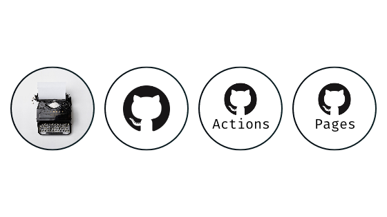
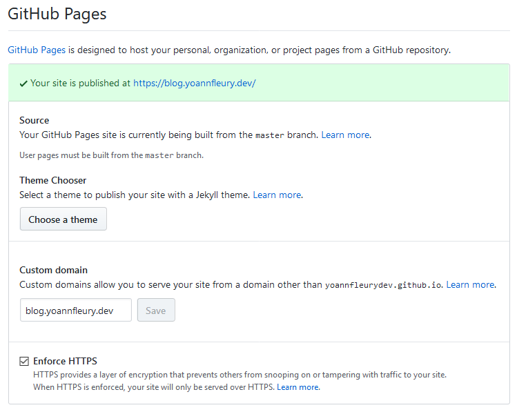
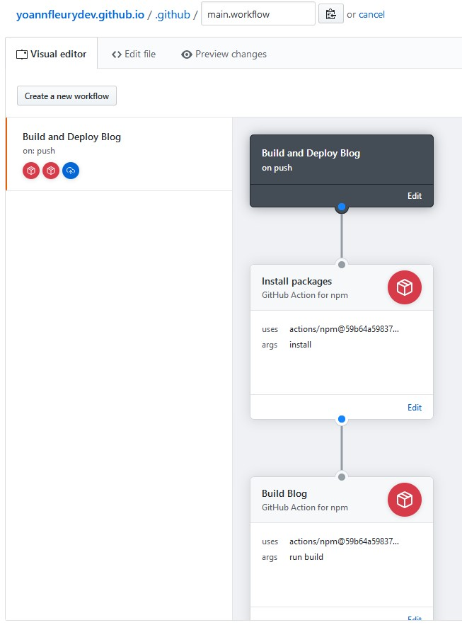
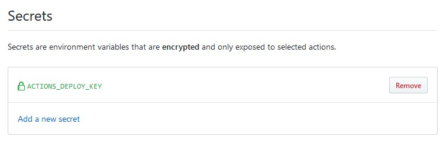
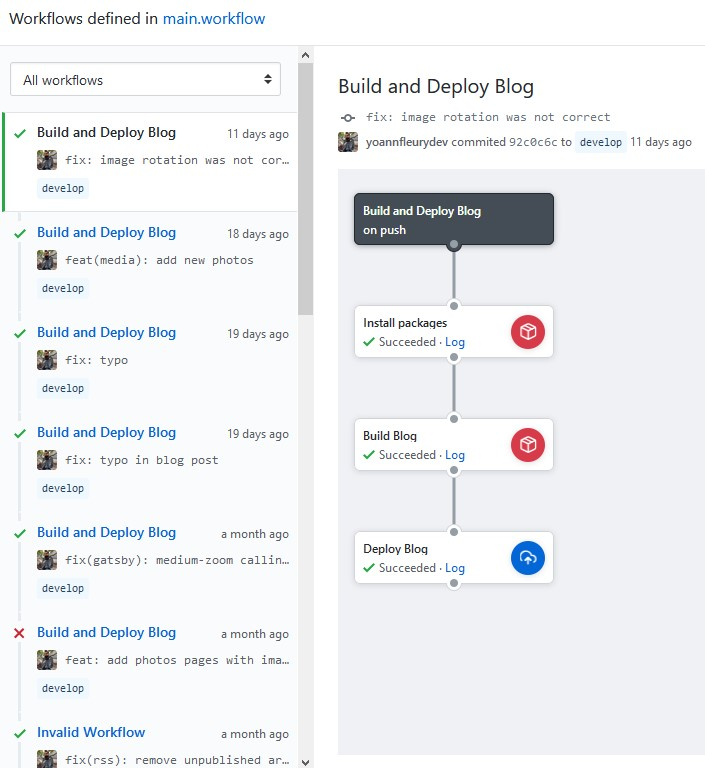

import { Warning } from "components/Alert";

<Warning>
  Cet article est un peu vieux, et ce n'est plus de cette façon que le blog est
  déployé.
</Warning>

> Comment ce blog est-il déployé, sur quelle infrastructure tourne-t-il, est-ce
> que tout est automatisé ? Nous allons répondre à ces questions dans ce billet.



[Gatsby], c'est chouette, ça permet vraiment beaucoup de choses intéressantes
pour gérer du contenu (j'y reviendrai peut-être lors d'un autre billet de blog),
mais il y avait un truc qui ne me plaisait pas, c'est qu'il fallait que je lance
plusieurs commandes, identiques à chaque nouvel article, pour mettre à jour mon
site... Je suis développeur, je suis pour l'automatisation, je veux donc
optimiser mon temps et gagner quelques secondes par-ci, par-là.

## Github et Github Pages

Le code source du blog est hébergé sur [Github], à des fins pratiques, car j'ai
toutes mes sources sur cet outil car tous mes projets personnels sont publics
sur le modèle du libre et de l'Open Source. [Github] permet de stocker le code
source de vos applications et bien plus, on le verra par la suite.

J'ai créé le dépôt de ce blog sous le nom `yoannfleurydev.github.io`, j'en
parlais dans [mon précédent post](../mise-en-place-de-ce-blog) si vous l'avez
manqué.


Il faut savoir qu'en faisant cela, j'ai directement accès au [Github Pages] sur
le domaine [yoannfleurydev.github.io](https://yoannfleurydev.github.io). Allez
y, cliquez, vous allez directement retomber sur l'accueil du blog grâce à la
redirection que j'ai défini dans les paramètres du dépôt.



Les [Github Pages] permettent l'hébergement d'un site statique, personnel ou
bien pour de la documentation de projet. Je ne vais pas m'étendre sur le sujet
des Github Pages plus longuement, car la documentation de Github est plutôt
bonne à ce sujet, mais je vais juste prévenir que les Github Pages agissent
différemment selon le type de dépôt:

- Si c'est un dépôt personnel sous format `username.github.io`, seule la branche
  `master` sera disponible à l'hébergement, il faudra donc comme moi, si vous
  utilisez un outil qui construit votre site statique, le versionner sur une
  autre branche. J'ai pour ma part choisi de nommer cette branche `develop`.
- Si c'est un dépôt de projet vous pourrez choisir dans les paramètres du dépôt
  quelle branche sera disponible à l'hébergement sur le domaine
  `https://username.github.io/repository`. A noter qu'il est également possible
  de donner le dossier `docs/` afin d'éviter d'avoir deux branches différentes
  entre le projet et sa documentation.

Pour résumer, avant de tout automatiser, je devais écrire mes articles, _commit_
et _push_ sur `develop` pour versionner mon code et mes articles, puis lancer
`npm run build` et enfin _commit_ sur la branche `master` seulement les fichiers
construits par la commande de `build` pour ensuite _push_ tout ça.

Ma réaction face à toutes ces commandes :


C'est contraignant, et j'ai donc décidé de me simplifier la tâche avec une
bibliothèque `npm`: `gh-pages`.

## gh-pages

La bibliothèque [gh-pages] permet de se simplifier la vie pour déployer son site
statique sur les [Github Pages]. Avec elle, plus besoin de faire de _commit_ sur
`master` et _push_ sur Github, car une fois configurée, elle le fait
automatiquement pour nous en une seule commande.

Il ne me restait plus que deux commandes à lancer à partir de maintenant pour
mettre le blog à jour:

```sh
npm run build
npm run deploy
```

Du coup, pourquoi ne pas optimiser encore et n'en faire qu'une seule, car si je
veux déployer le nouveau site, il faut de toute façon que je le construise
avant dans tous les cas ! J'ai donc obtenu la commande `deploy` suivante :

```json {5}
// ...
"scripts": {
  "build": "gatsby build",
  "develop": "gatsby develop",
  "deploy": "gatsby build && gh-pages -d public -b master",
  "format": "prettier --write src/**/*.{js,jsx}",
  "start": "npm run develop",
  "serve": "gatsby serve",
  "test": "jest"
}
// ...
```

On lui dit de `build` le site, puis de ne _commit_ que le dossier `public/` sur
la branche `master`. Ainsi, j'écris mes articles, et je n'ai plus qu'à lancer
une seule commande:

```sh {1}
npm run deploy
```

OK, parfait, je gagne quelques secondes petit à petit. Mais bon, j'ai toujours
une commande à lancer pour mettre à jour mon site...


C'est là que les [Github Actions] entrent en jeu !

## Github Actions

Les [Github Actions] sont une fonctionnalité encore en bêta pour le moment, il
faut s'inscrire sur une liste d'attente pour en bénéficier.

On peut considérer cette nouvelle fonctionnalité comme une alternative à des
services de CI/CD existant déjà sur le marché. Ce n'est pas aussi puissant, mais
pour mes besoins pour le blog, c'est largement suffisant.

Les Github Actions peuvent être éditées sous deux formes :

1. Textuellement

```
workflow "Build and Deploy Blog" {
  on = "push"
  resolves = ["Deploy Blog"]
}

action "Install packages" {
  uses = "actions/npm@59b64a598378f31e49cb76f27d6f3312b582f680"
  args = "install"
}

action "Build Blog" {
  uses = "actions/npm@59b64a598378f31e49cb76f27d6f3312b582f680"
  needs = ["Install packages"]
  args = "run build"
}

action "Deploy Blog" {
  needs = "Build Blog"
  uses = "peaceiris/actions-gh-pages@v1.0.1"
  env = {
    PUBLISH_DIR = "./public"
    PUBLISH_BRANCH = "master"
  }
  secrets = [
    "ACTIONS_DEPLOY_KEY",
  ]
}
```

2. Graphiquement



Il est possible d'utiliser des secrets, ce qui est pratique dans mon cas pour
simuler un commit de ma part depuis les actions. Reprenons ensemble le fichier
d'action bloc par bloc :

```
workflow "Build and Deploy Blog" {
  on = "push"
  resolves = ["Deploy Blog"]
}
```

Ce premier bloc défini le nom du _workflow_, l'événement à écouter pour se
lancer (ici le `push`) et défini également quelle est l'action qui termine le
_workflow_.

```
action "Install packages" {
  uses = "actions/npm@59b64a598378f31e49cb76f27d6f3312b582f680"
  args = "install"
}
```

Cette première action installe les paquets nécessaires à la bonne construction
du projet. Elle utilise une image d'action `npm` sur le _commit_ `59b64a`. Il
suffit de donner à cette image un argument, qui est ici `install`, car on
souhaite lancer `npm install` dans le _workflow_.

```
action "Build Blog" {
  uses = "actions/npm@59b64a598378f31e49cb76f27d6f3312b582f680"
  needs = ["Install packages"]
  args = "run build"
}
```

La deuxième action dépend de la bonne résolution de l'action précédente
`needs = ["Install packages"]` et construit le site statique `npm run build`

```
action "Deploy Blog" {
  needs = "Build Blog"
  uses = "peaceiris/actions-gh-pages@v1.0.1"
  env = {
    PUBLISH_DIR = "./public"
    PUBLISH_BRANCH = "master"
  }
  secrets = [
    "ACTIONS_DEPLOY_KEY",
  ]
}
```

Cette troisième action n'est pas comme les autres car elle utilise une image
qui n'est pas `npm`. Ici, on utilise l'image `peaceiris/actions-gh-pages` qui
permet de déployer sur les Github Pages. Il suffit de lui passer les bons
paramètres d'environnements ainsi que le secret nécessaire pour permettre à
l'image de faire le _commit_ en notre nom.



---

> 💡 Pour en savoir plus sur les Github Actions, je recommande
> [ce très bon article](https://css-tricks.com/introducing-github-actions/)
> écrit par [Sarah Drasner](https://twitter.com/sarah_edo).

---

Et voilà, nous avons maintenant tout automatiser grâce aux Github Actions, dès
que je _commit_ et _push_ des nouveautés, elles sont automatiquement construites
et déployées. On dispose également d'un suivi de succès ou d'échecs ainsi que
des logs pour faciliter le débogage si besoin.



Vous avez maintenant toutes les clefs en main pour créer vous même votre blog
et le déployer automatiquement, et tout ça, pour 0€.

J'espère avoir fait le tour du propriétaire le plus clairement possible, si
question il y a, je suis toujours disponible sur
[Twitter](https://twitter.com/yoannfleurydev) et je répondrais avec plaisir.

[gatsby]: https://www.gatsbyjs.org/
[github]: https://github.com
[github actions]: https://github.com/features/actions
[github pages]: https://pages.github.com/
[gh-pages]: https://www.npmjs.com/package/gh-pages
