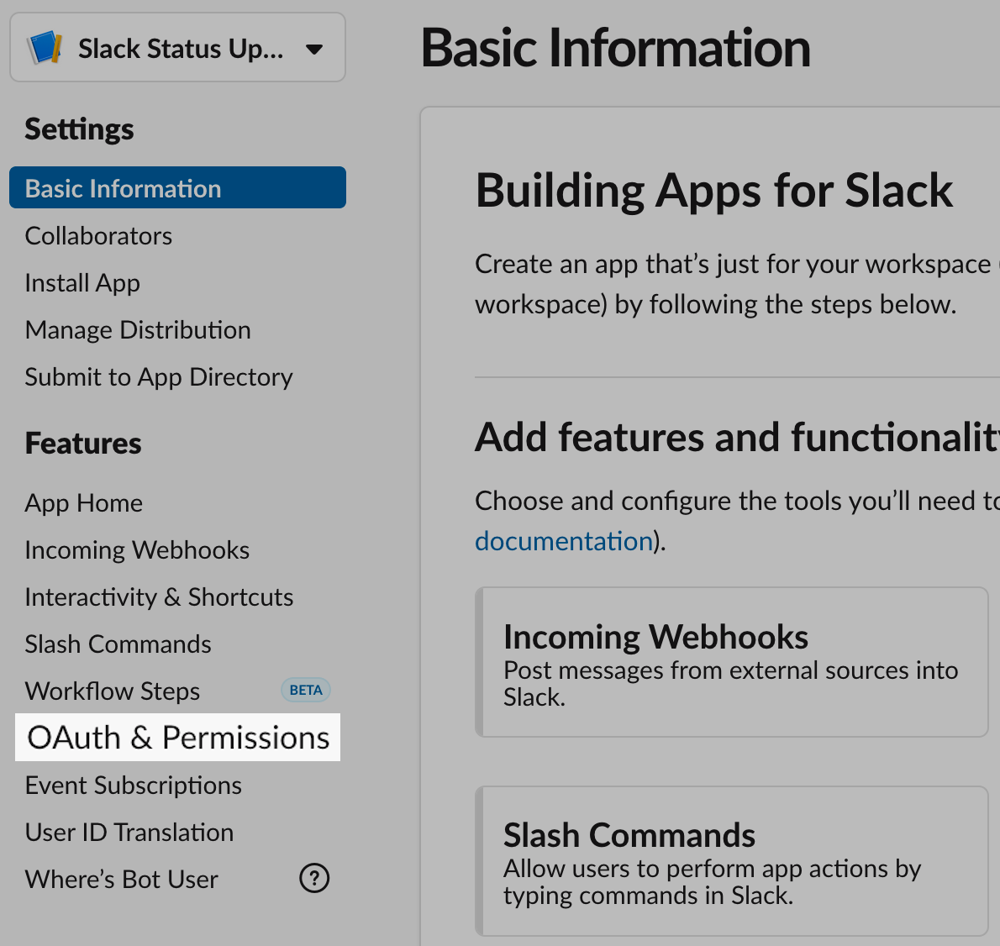
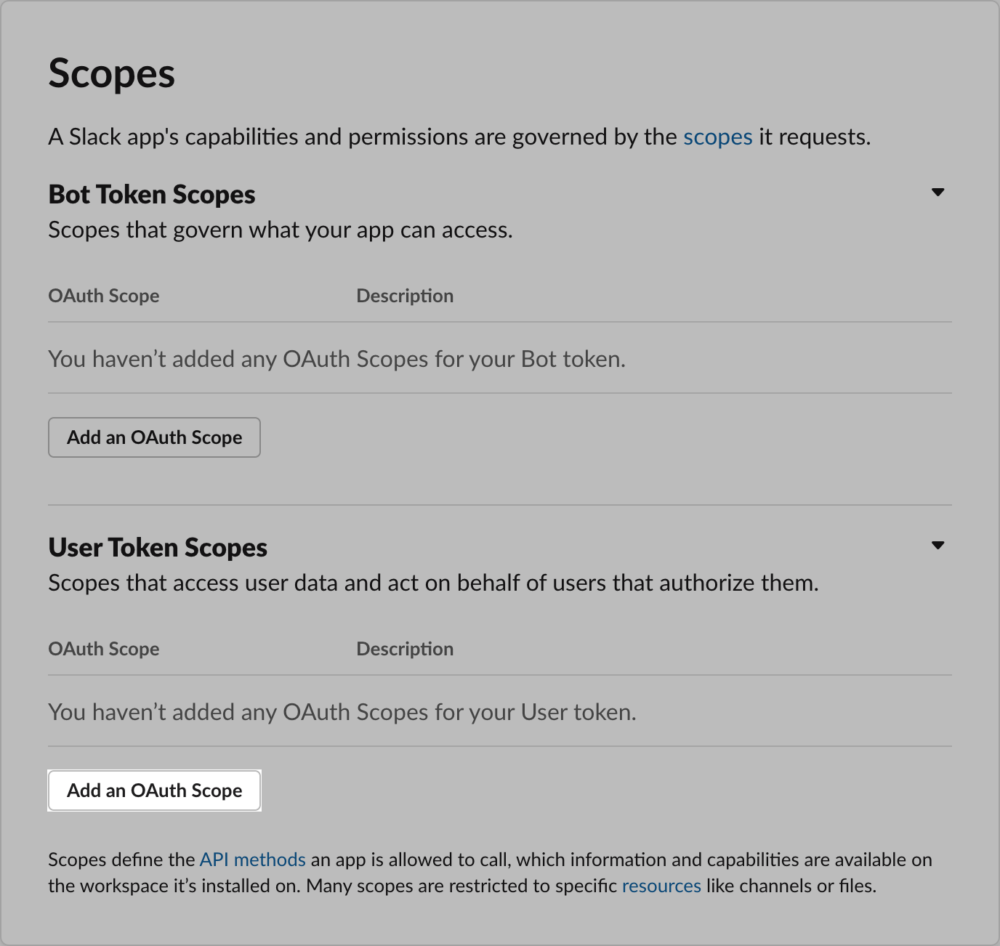

Il y a une fonctionnalité bien pratique avec Slack, c'est la possibilité de
mettre un statut. Bien pratique, parce qu'elle permet d'indiquer aux collègues
si nous sommes en vacances, absent aujourd'hui, dans les transports, ou encore,
automatiquement, dire que nous sommes en réunion avec l'application
[Google Calendar App](https://slack.com/app-pages/google-calendar).

Dans cet article, nous allons voir ensemble comment profiter de la force de
cette fonctionnalité en utilisant [le nouveau pack d'émoji](https://slackhq.com/new-emoji-pack-to-help-with-your-remote-work-balance)
pour gérer la balance du télétravail, un [script bash](https://github.com/mivok/slack_status_updater/blob/master/slack_status.sh),
et quelques avantages d'[i3wm](https://i3wm.org/) pour la mise à jour via
raccourcis clavier. Le contenu est adaptable à n'importe quel système
d'automatisation, et l'auteur·trice du script fournit également un script `lua`
pour Hammerspoon et Zoom.

Voici le résultat que nous souhaitons obtenir :

<figure>
  <video controls allowFullScreen>
    <source src="slack-status-update.mp4" type="video/mp4" />
  </video>
</figure>

## Création de l'application Slack

On va utiliser [un script bash](https://github.com/mivok/slack_status_updater)
écrit par l'utilisateur·trice GitHub [mivok](https://github.com/mivok)

> Ici, je vais traduire sommairement le README du dépôt où se trouve le script
> bash, pour le rendre plus accessible à ceux qui préfèrent le français.

1. Direction la [création d'application pour Slack](https://api.slack.com/apps/new).
2. Choisir un nom pour l'application: **Slack Status Updater**. (Il est
   intéressant de spécifier votre nom si vous êtes plusieurs à faire cette
   manipulation sur un même Slack)
3. Choisir le workspace Slack sur lequel installer cette application.
4. Ensuite, nous arrivons sur la page de configuration de l'application, sélectionner **OAuth & Permissions**



5. Descendre dans la partie **Scopes** et **User Token Scopes** et cliquer sur **Add an OAuth Scope**.



6. Écrire `users.profile:write` et cliquer sur l'élément du menu qui se présente
7. Retourner en haut de la page et cliquer sur **Install App to Workspace**.
8. Un nouvel écran apparait, cliquer sur **Allow**
9. On est ensuite redirigé vers un écran contenant un jeton d'accès commençant
   par `xoxp-`. On clique sur `Copy` pour le récupérer dans le presse-papier.

## Configuration

Une fois cette application créée, on lance la commande `slack_status.sh setup`
et on suit les instructions afin de créer le fichier de configuration qui
devrait ressembler à quelque chose comme suit:

```bash
# Configuration file for slack_status
TOKEN=<YOUR_TOKEN>

PRESET_EMOJI_test=":white_check_mark:"
PRESET_TEXT_test="Testing status updater"

PRESET_EMOJI_zoom=":zoom:"
PRESET_TEXT_zoom="In a zoom meeting"
```

On peut ensuite le modifier de façon à avoir quelque chose qui nous correspond
un peu plus:

```bash
TOKEN=<YOUR_TOKEN>

PRESET_EMOJI_zoom=":virtual-meeting:"
PRESET_TEXT_zoom="In a Virtual Meeting"

PRESET_EMOJI_brb=":brb:"
PRESET_TEXT_brb="Probably making coffee"

PRESET_EMOJI_here=":here:"
PRESET_TEXT_here="Available"

PRESET_EMOJI_away=":away:"
PRESET_TEXT_away="Not Available"
```

# Raccourcis avec i3wm

Maintenant que nous avons nos préréglages, nous pouvons automatiser la mise à
jour de notre statut Slack via des raccourcis sur i3wm. Dans un premier temps,
on va mettre notre statut à `here` quand on se connecter à notre session (c'est
à dire au chargement d'i3wm).

```
# Script to change Saagie's Slack Status
exec --no-startup-id "$HOME_BIN/slack_status.sh here"
```

Ensuite, on va créer un mode spécial ayant pour raccourci `MOD+Shift+s` avec `s`
pour statut. Ce mode va avoir 4 options de mise à jour de status et 2 options
pour ne rien faire:

- `h` pour `here` (présent)
- `a` pour `away` (absent)
- `b` pour `brb` (`be right back` reviens tout de suite)
- `z` pour `zoom` (pour la visio-conférence)
- `Return` et `Escape` pour ne rien faire et retourner en mode `default` d'i3wm.

```txt
# ----------------------------------
# EXTERNAL INTEGRATION
# ----------------------------------
set $slack_status_changer (h)ere, (a)way, (b)rb, (z)oom
mode "$slack_status_changer" {
    bindsym z exec --no-startup-id $HOME_BIN/slack_status.sh zoom; \
      mode "default"
    bindsym a exec --no-startup-id $HOME_BIN/slack_status.sh away; \
      mode "default"
    bindsym b exec --no-startup-id $HOME_BIN/slack_status.sh brb; \
      mode "default"
    bindsym h exec --no-startup-id $HOME_BIN/slack_status.sh here; \
      mode "default"
    # back to normal: Enter or Escape
    bindsym Return mode "default"
    bindsym Escape mode "default"
}
bindsym $mod+Shift+s mode "$slack_status_changer"
```

Et voilà, on peut maintenant faire `Mod+Shift+s` suivi de `b` pour faire
comprendre aux collègues que l'on est parti prendre un café. Puis une fois
revenu, `Mod+Shift+s` suivi de `h` pour indiquer que l'on est bien présent.

Dans le même esprit et toujours dans l'automatisation, je me suis mis une ligne
dans la configuration pour me mettre en `away` quand j'éteins ma machine le soir.

Voilà, j'espère que cet article va être utile. Je reste disponible sur [Twitter](https://www.twitter.com/yoannfleurydev)
pour toutes questions ou point bloquant sur cette automatisation, et sur ce,
bon dev. 👋
