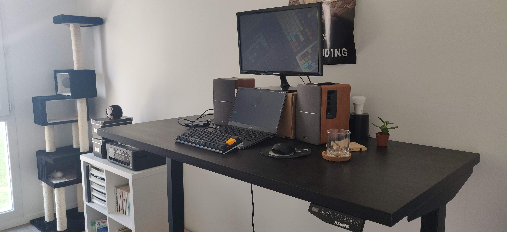
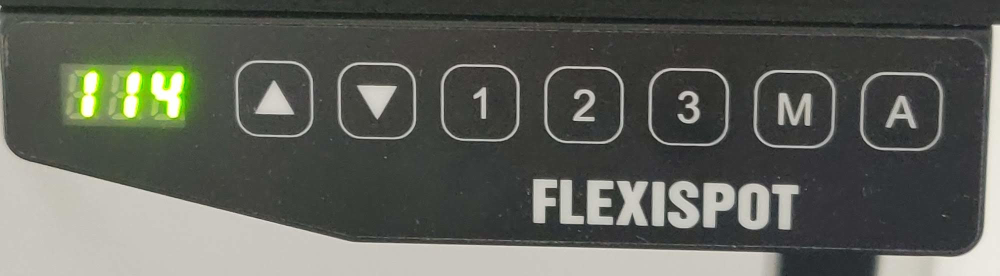
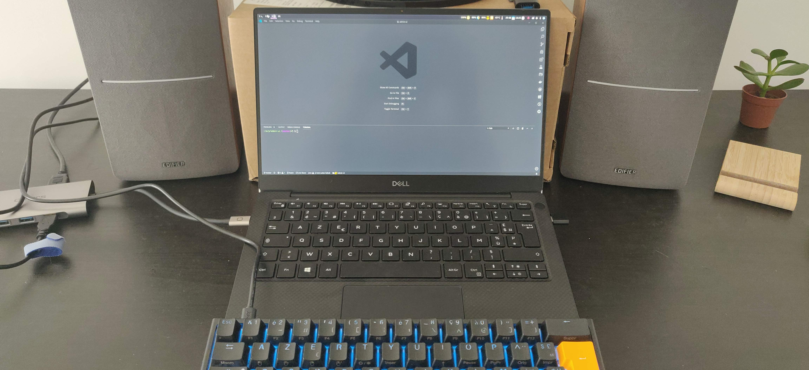
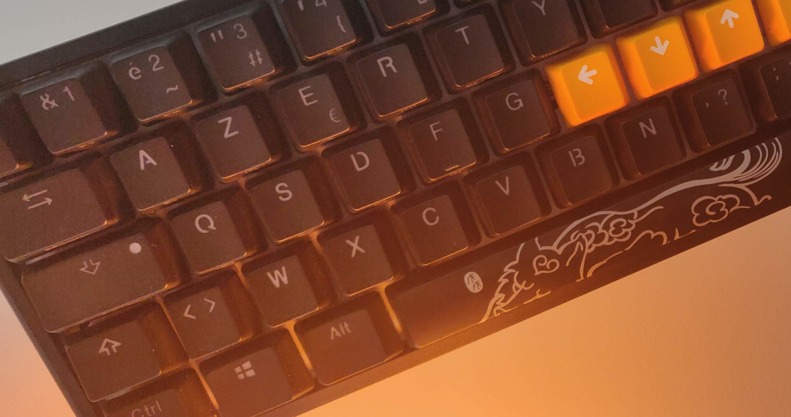
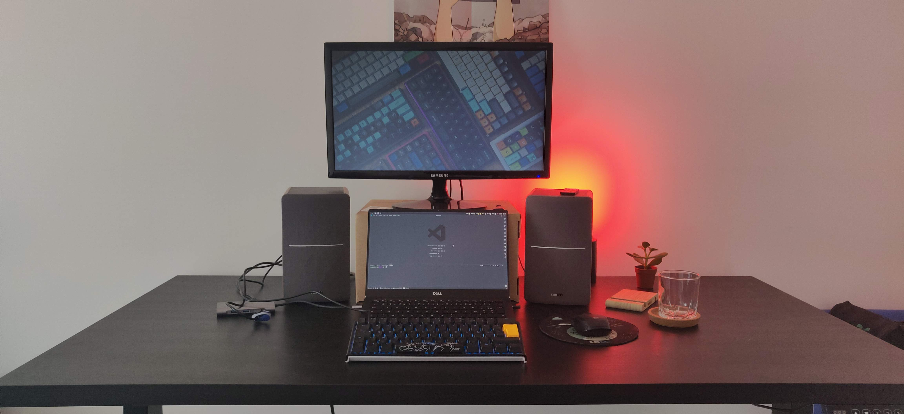

Être en télétravail, c'est pas mal pour gérer son bureau comme on le souhaite : écouter de la
musique sur les enceintes, prendre la place que l'on veut, avoir un clavier mécanique bruyant
sans gêner qui que ce soit, avoir une cat-workeuse...

<blockquote class="twitter-tweet">
J&#39;aime quand ma cat-workeuse 🐈 fait une code review attentive 👀 <a href="https://t.co/NsHmm0Nqxg">pic.twitter.com/NsHmm0Nqxg</a>
&mdash; Yoann Fleury 👨🏻‍💻 (@YoannFleuryDev) <a href="https://twitter.com/YoannFleuryDev/status/1163865728484806664?ref_src=twsrc%5Etfw">August 20, 2019</a></blockquote>

Bref, nombreux sont les avantages de bosser de chez soi, et c'est pourquoi il ne faut pas délaisser
son équipement et son cadre histoire d'être le plus focus possible. Ça va bientôt faire 1 an que je
suis en télétravail. Au début, je n'y connaissais rien, je me suis donc renseigné, et la plupart des
avis que je voyais étaient unanimes : il faut une pièce dédiée au travail pour séparer la vie
professionnelle de la vie personnelle. J'ai donc cherché un appartement me permettant de me faire
un bureau, et d'y mettre des meubles et accessoires me permettant d'être le plus focus possible.
Voici un tour de mon matériel de travail :

# Le bureau

Le meuble maître de la pièce, le bureau. Sans lui, obligé de travailler avec la machine sur les
genoux, ce qui, on peut l'avouer, n'est pas très pratique ni confortable. C'est un châssis de
bureau à taille adaptable électrique [E5B](https://www.amazon.fr/FLEXISPOT-Electrique-Assis-Debout-Inoxydable-Automatique/dp/B077JPC7PK)
de la marque Flexispot. J'en suis très satisfait, il est de très bonne qualité, il me permet de
régler finement le bureau sur 3 niveau: assis, semi-debout et debout. Il est également plutôt
intéressant car il peut se régler au niveau de la largeur, ce qui me permet de choisir un plateau
avec la largeur que je veux.

L'avantage d'un bureau électrique par rapport à un bureau manuel est de pouvoir sauvegarder les
différentes position pour tout le temps reprendre la même. Après, il est évidemment possible avec
certains bureaux manuels de mettre des marques pour se souvenir de la hauteur.

Pour ce qui est du plateau, j'ai fais au plus simple, un plateau [Linnmon](https://www.ikea.com/fr/fr/p/linnmon-plateau-brun-noir-10251352/)
de chez Ikea, mais je regrette un peu ce choix, certes lors de l'achat ce n'était pas très cher, mais ça se ressent
dans la durée. J’envisage donc de le changer dans quelques temps avec une planche plus résistante
et que j'aurais moi-même teinte.

# Le PC

Pour la machine professionnelle, je suis parti sur un [XPS 13 9380](https://www.dell.com/en-us/shop/laptops/13/spd/xps-13-9380-laptop).
C'est un ultraportable, ce qui m'est utile pour les déplacements. Ce modèle a la webcam qui est correctement placée en haut de
l'écran, pas comme son prédécesseur où elle était dessous, avec une vue en contre plongée sur les narines des collègues.

Cette machine est vraiment puissante pour sa taille, ce qui est plutôt cool. Le seul inconvénient
que je lui trouve pour le moment, c'est sa chaleur. Quand je suis en visio-conférence sur Zoom,
elle a tendance à rapidement monter dans les +65°C et je le sens au niveau du clavier, ce qui n'est
pas le plus agréable quand je n'utilise pas mon clavier externe.

# L'écran

Mon écran est plutôt vieux, c'est un Samsung S22D300 de mauvaise qualité (j'évite de jouer avec les
couleurs sur cet écran par exemple). Je l'ai acheté il y a quelques années quand j'étais étudiant et
que j'avais peu d'argent. Je ne le conseille donc pas, mais il m'est utile pour y mettre le [Zoom](https://zoom.us/),
le [Slack](https://slack.com/intl/fr-fr/), ou alors le navigateur quand je suis en rechargement à
chaud histoire de voir mes changements sans changer d'espace de travail.

# Le clavier

Nous voilà dans la partie la plus intéressante ! Je possède un
[Ducky Channel One 2 Mini RGB équipé de Cherry MX Brown](https://shop.hardware.fr/fiche/AR201810250029.html).
C'est vraiment un super clavier mécanique compact qui me permet de le transporter avec moi sans perdre trop de place.

La principale inquiétude quand on me voit avec ce clavier est : 

> Mais comment tu fais sans les flèches ? 😲

Eh bien tout simplement, j'en ai pas besoin. Comme mon environnement est basé sur la logique des
key-mapping de Vim (combo entre i3wm, tmux, Vim, et des plugins Vim pour VS Code et Firefox), je
n'ai besoin des flèches que très très rarement, et quand c'est le cas, j'utilise la touche de
fonction à cet effet.

# Les enceintes

On arrive dans le petit plus qui fait énormément plaisir quand on est en télétravail: les enceintes.
Il est compliqué d'avoir du son sur haut parleur quand on est en bureau partagé avec ses collègues.
Et le truc, c'est que
[j'adore](https://open.spotify.com/playlist/6tIPD04a91TK6tR9fSxWu7?si=eAs2ROmBRsabG71cSspsrg)
[écouter](https://open.spotify.com/playlist/6KA6z82U8tMIX722CbdCzj?si=wuZyFBaWSxuxev7Ue6V2KQ)
[de la musique](https://open.spotify.com/playlist/1xPEJgLzuHkQriUnfXedPF?si=3Rvexom8QYitAeNfWjW57g)
[de](https://open.spotify.com/playlist/4gVoERNykOYjewFfLWCXnd?si=h7ipJynXSLSfX_iRxBbqGA)
[tout](https://open.spotify.com/playlist/3QicXa9nD2AZKJrxWbzbxw?si=ADD3sxF3SK-JEm5aWfjsKA)
[genre](https://open.spotify.com/playlist/1APGGAfEig9dXsZr8OIsVM?si=b9xSJupdSq6Simg1sFxxgQ)
[en](https://open.spotify.com/playlist/6czL7oQHmWQtZGNy0kVnKb?si=HRfsi3VaSCm8fvA9KRPm3g)
[développant](https://open.spotify.com/playlist/58A3bBcIXXyJJFS9uyh0El?si=h1oNxGNpRtORDb8h3lZDmQ),
ça me donne une pèche énorme.

Ici, je voulais donc de la qualité et avec le Bluetooth pour éviter encore plus de fils, et sur les
précieux conseils d'un ami, je suis parti sur des Edifier R1280DB Bois. Ce sont de très bonnes
enceintes avec pas mal de connectiques et des aigues et graves réglables, ce qui m'allait
parfaitement.

# Les petits plus

* Un [tapis anti-fatigue](https://flexispot.com/standing-desk-anti-fatigue-mat-mt1-mt2) pour
  position debout que j'ai récemment reçu, je ne peux pas trop faire de retour dessus pour le moment.
* Un [support pour téléphone](https://www.ikea.com/fr/fr/p/bergenes-support-telephone-portable-tablette-bambou-10457999/)
  qui m'est pas mal utile lors de développement perso pour du web mobile.
* Une petite plante, parce qu'un peu de verdure ne fait pas de mal.
* Un ampoule Philips Hue derrière l'écran et une autre au plafond pour jouer un peu sur la lumière
  de la pièce en fonction de mon humeur.

