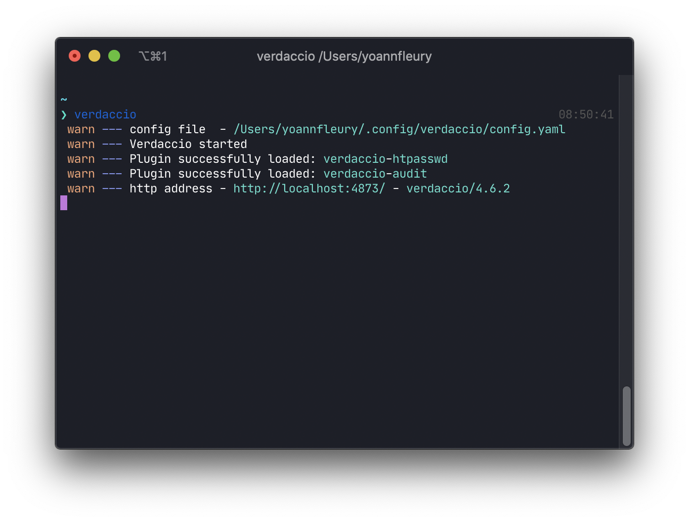
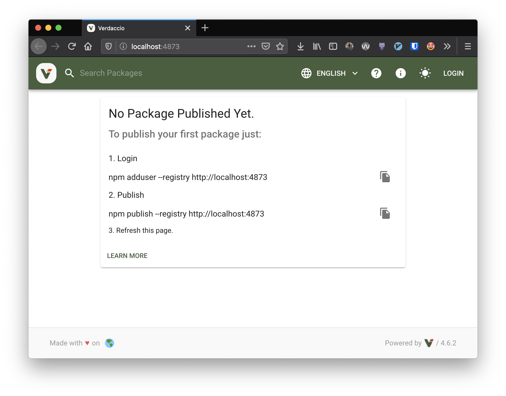
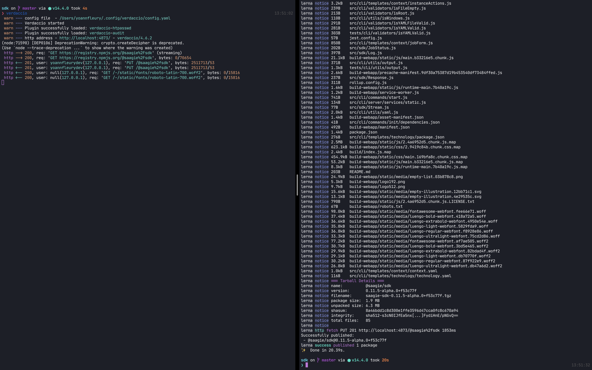
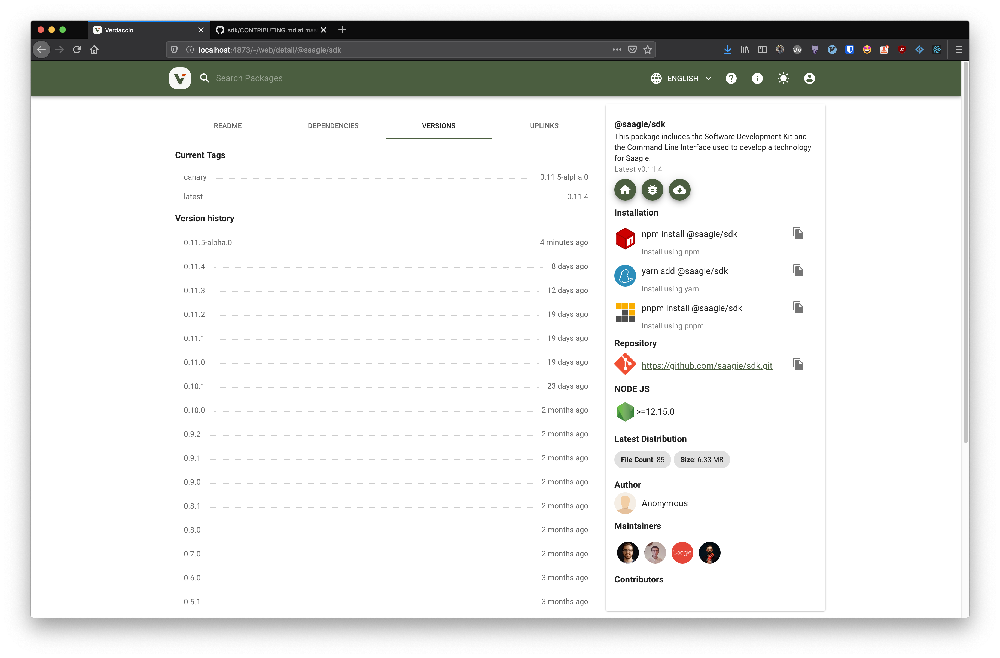

> Présentation de Verdaccio, un outil alternatif à npm pour tester
> une publication d'un paquet.

## Le problème

Il y a quelques mois, [@IvanDalmet](https://twitter.com/IvanDalmet) et moi avons rencontré une problématique lors du développement d'un outil en ligne de commande pour [Saagie](https://www.saagie.com/). Nous souhaitions pouvoir tester la publication en `dry-run` (c'est à dire, faire une publication qui ne soit pas sur le dépôt [npm](https://www.npmjs.com/)) avec [lerna](https://github.com/lerna/lerna), malheureusement, `lerna` ne permet pas de le faire.

## La solution

Nous avons alors cherché une autre solution à la question : **Comment publier sur un dépôt autre que le registre npm ?** Et nous sommes tombés sur [Verdaccio](https://verdaccio.org/), un registre de paquets npm installable localement (ou sur un serveur) et sans configuration nécessaire ! Et il semblerait que tout un tas d'autres développeurs aient rencontrés cette problématique avant nous :

<blockquote class="twitter-tweet">
  <p lang="en" dir="ltr">
    Woke up to{" "}
    <a href="https://twitter.com/timer150?ref_src=twsrc%5Etfw">@timer150</a>{" "}
    fixing end-to-end test flakiness in Create React App 👏 Background: we have
    a Lerna monorepo and used very complex hacks for integration testing of
    generated projects. Solution: run a local npm registry to simulate a publish
    😁 <a href="https://t.co/ggNfS4PpFv">https://t.co/ggNfS4PpFv</a>
  </p>
  &mdash; Dan Abramov (@dan_abramov) <a href="https://twitter.com/dan_abramov/status/951427300070916096?ref_src=twsrc%5Etfw">January 11, 2018</a>
</blockquote> <script
  async
  src="https://platform.twitter.com/widgets.js"
  charset="utf-8"
></script>

[Verdaccio](https://verdaccio.org/en/) ([dépôt GitHub](https://github.com/verdaccio/verdaccio)) se définit comme un dépôt et proxy, privé, léger et open source pour npm. Ce que je trouve vraiment cool avec cet outil, c'est qu'il fait une chose, et la fait bien.

## Installation via un gestionnaire de paquets

Pour installer Verdaccio, il faut tout d'abord avoir `npm` ou `yarn`, puis lancer la commande :

```bash
npm install --global verdaccio # avec npm
yarn global add verdaccio # avec yarn

verdaccio # lance l'outil afin que le serveur web soit up
```

## Installation via docker

Il est possible de ne pas installer Verdaccio directement sur ton système mais plutôt de passer par `docker` avec la commande suivante :

```bash
docker run -it --rm --name verdaccio -p 4873:4873 verdaccio/verdaccio
```

## Utilisation

Si tu as suivi une des deux méthodes d'installation ci-dessus, tu dois avoir la sortie suivante sur ton terminal :



Tu peux désormais accéder à l'interface de verdaccio sur [http://localhost:4873](http://localhost:4873) si tu as lancé l'outil en ligne de commande, ou bien [http://0.0.0.0:4873](http://0.0.0.0:4873) si lancé depuis `docker`.



Cette interface explique comment créer un nouvel utilisateur, il suffit de lancer la commande donnée et de se laisser guider par les questions.

```bash
npm adduser --registry http://localhost:4873
```

Maintenant que le serveur est démarré et que tu es authentifié, il est possible de lancer la commande de publication. Pour le projet [@saagie/sdk](https://github.com/saagie/sdk), nous avons créé une entrée dans la partie `script` du `package.json`, car il faut l'avouer, elle est plutôt bien fournie en options.

```json
{
  "...": "...",
  "build": "yarn build:webapp && yarn build:sdk",
  "build:webapp": "lerna run build --scope @saagie/sdk-webapp --stream",
  "build:sdk": "lerna run build --scope @saagie/sdk --stream",
  "deploy": "yarn build && lerna publish",
  "verdaccio:publish": "yarn deploy --canary --force-publish --registry http://localhost:4873",
  "verdaccio:unpublish": "version=$(npm view @saagie/sdk dist-tags.canary --registry http://localhost:4873) && npm unpublish @saagie/sdk@${version} --registry=http://localhost:4873",
  "...": "..."
}
```

Découpons ensemble les étapes du script `verdaccio:publish` :

- Construction des paquets à publier en utilisant le script `deploy`
- Lancement de la commande `lerna publish` avec les options suivantes
  - `--canary` permet de publier en `alpha`
  - `--force-publish` permet de forcer la publication, même si aucun changement n'a eu lieu depuis la dernière publication. Ainsi on peut tester une publication à tout moment, même sans faire de nouveau commit.
  - `--registry` permet de définir Verdaccio en tant que nouveau registre.

Le script `verdaccio:unpublish` permet ensuite de dépublier la dernière version `canary` qui a été publiée.

En lançant le script sur le projet `@saagie/sdk`, on obtient le résultat suivant pour les logs:



Et le résultat sur l'interface web de Verdaccio :



Voilà pour une rapide présentation de Verdaccio. Si tu as des questions suite à la lecture de cet article, tu peux me retrouver sur [twitter](https://twitter.com/YoannFleuryDev) pour me les poser.
