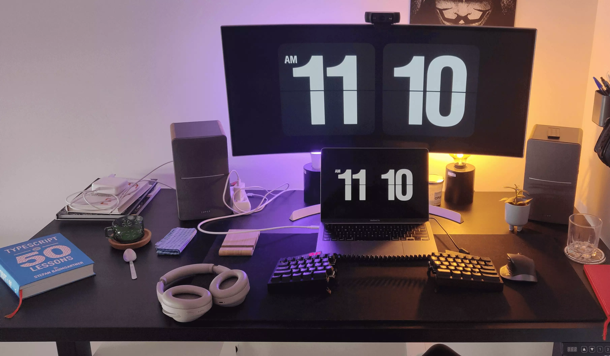
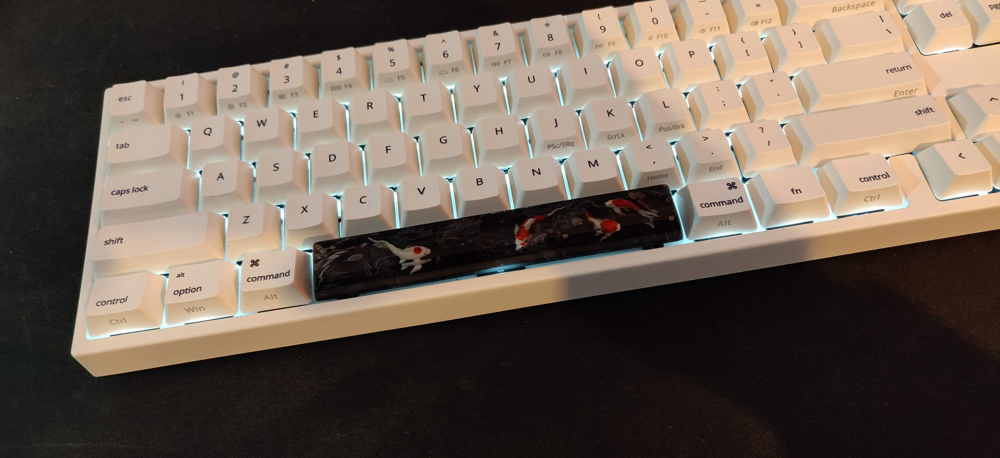

This page is inspired by the [Wes Bos](https://twitter.com/wesbos)' [Uses](https://wesbos.com/uses/) page.

# Softwares

## Editor

### VS Code

I am using VS Code as my main editor as I'm a JavaScript developer, but I love
the comfort of IntelliJ for Java and PhpStorm for PHP if I need to work using
these languages.

I sometimes open Vim for some quick changes in the terminal.

Here is a quick listing of the extensions I installed on my VS Code (minus the
ones specific to languages):

- Bracket Pair Colorizer `coenraads.bracket-pair-colorizer`
- Clipboard Manager `edgardmessias.clipboard-manager`
- EditorConfig for VS Code `editorconfig.editorconfig`
- [Gitlab Merge Request Upvotes](https://github.com/yoannfleurydev/vscode-gitlab-merge-request-upvotes) `yoannfleurydev.gitlab-merge-request-upvotes`
- GitLens - Git Supercharged `eamodio.gitlens`
- Live Share `ms-vsliveshare.vsliveshare`
- Prettier - Code formatter `esbenp.prettier-vscode`
- Project Manager `alefragnani.project-manager`
- Template String Converter `meganrogge.template-string-converter`

I use [Dracula](https://draculatheme.com/) color theme for almost all my
applications and [JetBrains Mono](https://www.jetbrains.com/lp/mono/) as a
monospace font. I have used [Cascadia Code](https://github.com/microsoft/cascadia-code)
and [Fira Code](https://github.com/tonsky/FiraCode) in the past.

## Terminal

[iTerm2](https://iterm2.com/) is my terminal of choice, I have also used [Alacritty](https://github.com/jwilm/alacritty)
on Linux. As a Shell, I'm using [Fish](https://fishshell.com/) and the prompt
is powered by [Starship](https://starship.rs/).

## Browser

[Firefox](https://www.mozilla.org/en-US/firefox/new/) is my main browser for
personnal usage, and [Google Chrome](https://www.google.com/chrome/) is the one
I use professionally.

### Extensions

- [GitHub Refined](https://github.com/sindresorhus/refined-github)
- [Wappalyzer](https://www.wappalyzer.com/)
- [Octotree](https://www.octotree.io/)
- [uBlock](https://github.com/gorhill/uBlock)

## Desktop Applications

- I use [Rectangle](https://rectangleapp.com/) for window management.
- As a Spotlight alternative, I use [Raycast](https://raycast.com/)
- [Notion](https://notion.so) as my knowledge base and note taking application.
- [I'm](https://open.spotify.com/playlist/6tIPD04a91TK6tR9fSxWu7?si=j3aavs6OTw2DOnt2a6HoTQ) [a](https://open.spotify.com/playlist/6KA6z82U8tMIX722CbdCzj?si=q8-bcg2bTmWd5VG0t5lVJw) [huge](https://open.spotify.com/playlist/1xPEJgLzuHkQriUnfXedPF?si=pfaNSFtXTMOBN9mGWzNjrg) [music](https://open.spotify.com/playlist/3QicXa9nD2AZKJrxWbzbxw?si=Xxj-MEUfQ8iEUCd_RuBgrQ) [listener](https://open.spotify.com/playlist/1APGGAfEig9dXsZr8OIsVM?si=ogAgRbaVTb27rb0HZdSAaw), and use [Spotify](https://spotify.com) for the music.
- I use [GitHub Desktop](https://desktop.github.com/) for simpliest Git workflows
- [Bitwarden](https://bitwarden.com/) is my go to for password management.
- [Raindrop](https://raindrop.io) to store links.

# Desk Setup

## Battle Station

- 2 Dell monitors, not made for gaming, I plan to buy a 144Hz monitor in the
  near future.
- [beyerdynamic DT-770 Pro 80 Ohm](https://www.thomann.de/fr/beyerdynamic_dt770_pro80_ohm.htm)
  headset and a [Rode NT1-A](https://www.thomann.de/fr/rode_nt1a_complete_vocal_recording.htm)
  mic linked to a [Focusrite Scarlett Solo 3rd Gen](https://www.thomann.de/fr/focusrite_scarlett_solo_3rd_gen.htm)
  audio USB interface. The mic stands on a [Rode PSA-1](https://www.thomann.de/fr/rode_psa1.htm)
  mic stand.
- I walk with a [Ducky x Varmilo MIYA Pro Mac White LED 65% Dye Sub PBT Mechanical Keyboard](https://mechanicalkeyboards.com/shop/index.php?l=product_detail&p=4285)
  keyboard with red switches and aim with a [Logitech G Pro Wireless Gaming Mouse](https://www.ldlc.com/fiche/PB00256935.html).

- 🔥 Computer specs:
  - AMD Ryzen 5 2600X Wraith Spire Edition (3.6 GHz)
  - ASUS DUAL RTX 3070 O8G DDR6
  - MSI B450M Pro-M2 Max
  - G.Skill Flare X Series 32 Go (2 x 16 Go) DDR4 3200 MHz CL16
  - Samsung SSD 860 EVO 250 Go
  - Seagate BarraCuda 1 To (ST1000DM010)
  - Seasonic FOCUS GX 750 Gold
  - be quiet! Silent Base 800 (Noir/Argent)
- I sit in an [Autonomous Ergochair 2](https://www.autonomous.ai/office-chairs/ergonomic-chair)
- I have 9 Nanoleafs panels for some light mood.

## Work Station

- [Apple M1 Chip with 8-Core CPU and 8-Core GPU 512GB Storage 16GB Unified Memory](https://www.apple.com/shop/buy-mac/macbook-pro/13-inch-space-gray-apple-m1-chip-with-8-core-cpu-and-8-core-gpu-512gb)
- The screen is a [LG 34" LED - 34UC99-W](https://shop.hardware.fr/fiche/AR201911080013.html)
- Standing Desk [Flexispot E5B](https://www.amazon.fr/gp/product/B077JPC7PK/ref=ppx_yo_dt_b_search_asin_title?ie=UTF8&psc=1)
- Headset [Sony WH-1000XM4 Argent](https://shop.hardware.fr/fiche/AR202010140608.html) for meetings and
  [Edifier R1280DB Bois](https://shop.hardware.fr/fiche/AR201804050026.html) as speakers for music.
- [Ultimate Hacking Keyboard](https://ultimatehackingkeyboard.com/) keyboard with Cherry MX Brown switches.
- Logitech MX Master 2S as a mouse.
- I do between 10 and 20 kilometers of bike per day on my [Flexispot Bike](https://www.flexispot.com/all-in-one-desk-bikes-deskcise-pro)
- For the lighting mood, I have some Philips Hue behind the screen.
